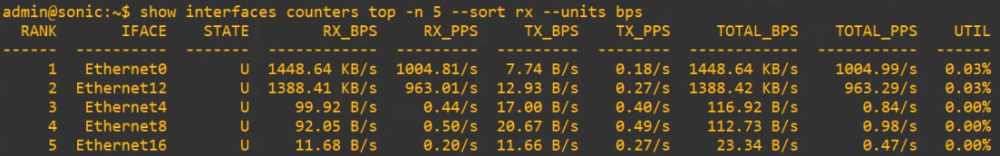

Through guided, hands-on project work, the SONiC Mentorship Program helps new contributors turn technical challenges into real-world open source impact. In this spotlight, we speak with Rishik Yalamanchili, an undergraduate student at Dhirubhai Ambani University (formerly DA-IICT), about his work on introducing a Top-N interface traffic visibility feature in SONiC.

### About the Mentee

My name is Rishik Yalamanchili, and I am a final-year (4th year) undergraduate student majoring in Information and Communication Technology (Honours) with a minor in Robotics and Autonomous Systems at Dhirubhai Ambani University.

I have always been actively involved in open-source projects in the background. Last year, I participated in Google Summer of Code (GSoC) under Waycrate, where I worked extensively with Linux systems. My interest in open source has always been strong, but I wanted to dip my toes into the networking department and understand how it works under the hood. The SONiC Mentorship Program matched my taste perfectly, giving me the opportunity to explore open-source networking operating systems.

### Q: What project did you work on, and why is it important to SONiC?

I worked on the **Top-N Interface Traffic Visibility Feature in SONiC**. 

In large-scale data center deployments with hundreds of ports, operators often need to quickly identify which interfaces are carrying the highest traffic. While SONiC exposes per-interface traffic counters and provides tools like `show interfaces counters rates` to display current rates for all interfaces, there was no mechanism to quickly rank and find the most congested interfaces. Scanning through hundreds of ports manually is inefficient and error-prone. 

This project solves that problem by introducing the `show interfaces counters top` command. It enables network operators to immediately identify the top N interfaces carrying the highest traffic by leveraging the pre-computed rate values already maintained in the `COUNTERS_DB`. It works as a thin filter, requiring zero backend changes while drastically improving network monitoring efficiency.

### Q: What were your main technical contributions?

My main contribution was implementing the `top` subcommand under the existing `show interfaces counters` CLI group within the `sonic-utilities` repository. 

Rather than creating new daemons or database tables, the feature was designed as a lightweight, in-memory filter on top of the existing `Portstat` class infrastructure. It reads the pre-computed rate entries (`RATES:<oid>`, e.g., `RATES:oid:0x1000000000002`) maintained by the `port_rates.lua` flex counter plugin registered by `orchagent`. Crucially, because these values are already EWMA-smoothed (Exponentially Weighted Moving Average), the command can execute immediately without requiring a traditional sample-and-diff round trip. It then sorts them based on a user-selected key, and displays the top N results.

I extended the `scripts/portstat` script with new flags and added the core sorting logic (`get_top_n()`) into `utilities_common/portstat.py`. I ensured the feature is highly customizable, allowing operators to:
- Rank interfaces by different keys: `total`, `rx`, `tx`, and `util` (utilization).
- Sort by either bytes/s (`--units bps`) or packets/s (`--units pps`). (Note: While 'bps' conventionally stands for bits per second, SONiC's rate fields are derived directly from hardware octet counters, meaning the CLI's `bps` metric is actually byte-based).
- Generate JSON output for automation systems.
- Use natural sorting (`natsort`) as a deterministic tie-breaker for interfaces with identical rates (e.g., zero traffic).

### Q: What challenges did you face, and what did you learn?

The biggest difficulty I faced initially was the environment setup itself. The documentation regarding the Docker setup and virtual machine environments was quite messy and outdated. It took a significant amount of time to understand the depths of dependency hell and kernel modules to get everything running properly. However, once I got the hang of it, I was able to ease into the development process and deeply understand the entire SONiC architecture.

From a development perspective, I learned a crucial lesson from my mentor: planning and architecture design take much more time and consideration than the actual execution. We iterated and improved upon the High-Level Design (HLD) several times before writing the code, which ultimately made the implementation robust and smooth.

### Q: What impact has this mentorship had, and what are your next steps?

This mentorship has given me the confidence to work with massive networking systems. The command is instantaneously responsive and fully backward-compatible, giving operators an immediate quality-of-life improvement for monitoring heavily loaded interfaces. 

Going forward, I plan to continue contributing to open-source projects and maintaining the open-source ecosystem. For this project specifically, I hope to implement some of the stretch goals we outlined in the HLD, such as adding a `--threshold` flag (to show interfaces exceeding a certain traffic watermark) and a `--reverse` flag (to find the least busy interfaces) to SONiC in the near future.

### Q: Is there anyone you'd like to acknowledge?

Many, many thanks to my mentor, Nikhil Moray. He helped me on several occasions and was always supportive, whether it was about setting up the environment, refining the HLD documentation, or reviewing the code. Nikhil always looked at everything in detail and was incredibly open and friendly, even telling me I could call him whenever needed. 

I would also like to thank Madhu Paluru, who oversaw our progress and supported the mentorship behind the scenes. Finally, a big thank you to the LFX team and the SONiC community for providing this amazing opportunity!

### Get Involved

Interested in contributing to SONiC? Join the community and get involved through wiki, mailing lists, and working groups.
